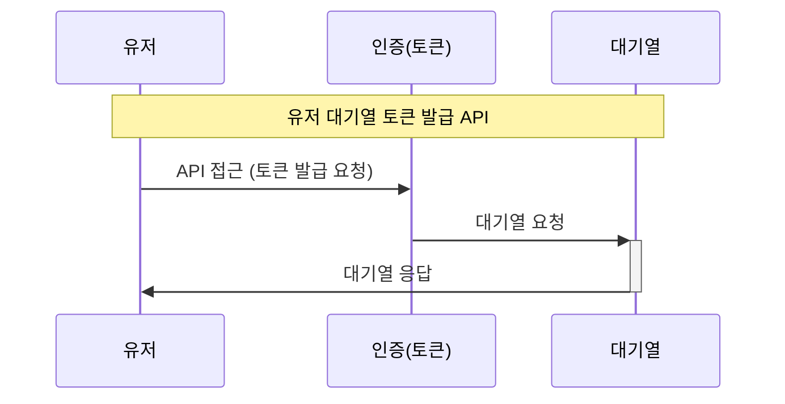
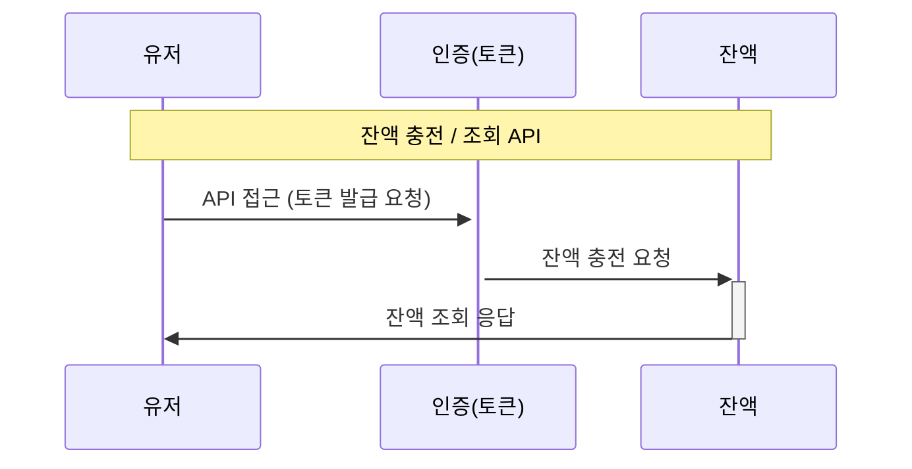
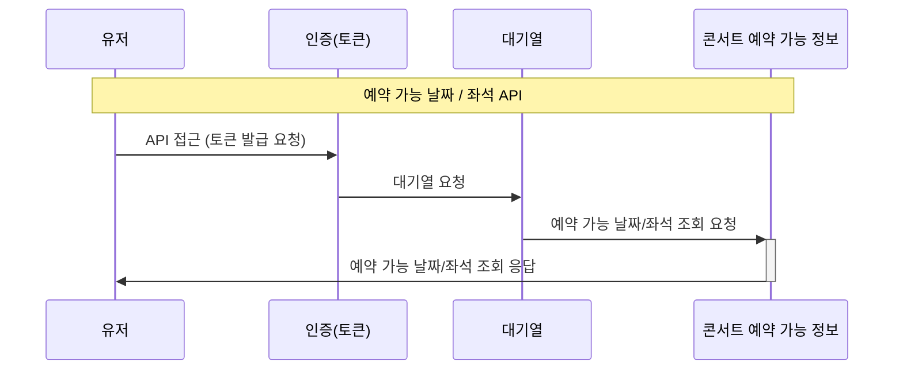
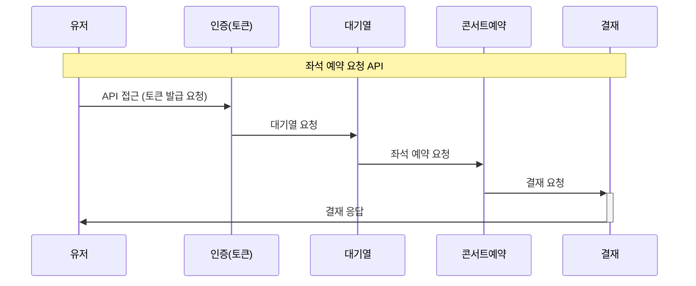

<details>
<summary>요구사항</summary>

## Description

- **`콘서트 예약 서비스`**를 구현해 봅니다.
- 대기열 시스템을 구축하고, 예약 서비스는 작업가능한 유저만 수행할 수 있도록 해야합니다.
- 사용자는 좌석예약 시에 미리 충전한 잔액을 이용합니다.
- 좌석 예약 요청시에, 결제가 이루어지지 않더라도 일정 시간동안 다른 유저가 해당 좌석에 접근할 수 없도록 합니다.

## Requirements

- 아래 5가지 API 를 구현합니다.
    - 유저 토큰 발급 API
    - 예약 가능 날짜 / 좌석 API
    - 좌석 예약 요청 API
    - 잔액 충전 / 조회 API
    - 결제 API
- 각 기능 및 제약사항에 대해 단위 테스트를 반드시 하나 이상 작성하도록 합니다.
- 다수의 인스턴스로 어플리케이션이 동작하더라도 기능에 문제가 없도록 작성하도록 합니다.
- 동시성 이슈를 고려하여 구현합니다.
- 대기열 개념을 고려해 구현합니다.

## API Specs

1. **`주요` 유저 대기열 토큰 기능**

- 서비스를 이용할 토큰을 발급받는 API를 작성합니다.
- 토큰은 유저의 UUID 와 해당 유저의 대기열을 관리할 수 있는 정보 ( 대기 순서 or 잔여 시간 등 ) 를 포함합니다.
- 이후 모든 API 는 위 토큰을 이용해 대기열 검증을 통과해야 이용 가능합니다.

> 기본적으로 폴링으로 본인의 대기열을 확인한다고 가정하며, 다른 방안 또한 고려해보고 구현해 볼 수 있습니다.
>

2. **`기본` 예약 가능 날짜 / 좌석 API**

- 예약가능한 날짜와 해당 날짜의 좌석을 조회하는 API 를 각각 작성합니다.
- 예약 가능한 날짜 목록을 조회할 수 있습니다.
- 날짜 정보를 입력받아 예약가능한 좌석정보를 조회할 수 있습니다.

> 좌석 정보는 1 ~ 50 까지의 좌석번호로 관리됩니다.
>

3.  **`주요` 좌석 예약 요청 API**

- 날짜와 좌석 정보를 입력받아 좌석을 예약 처리하는 API 를 작성합니다.
- 좌석 예약과 동시에 해당 좌석은 그 유저에게 약 5분간 임시 배정됩니다. ( 시간은 정책에 따라 자율적으로 정의합니다. )
- 만약 배정 시간 내에 결제가 완료되지 않는다면 좌석에 대한 임시 배정은 해제되어야 하며 다른 사용자는 예약할 수 없어야 한다.

4.  **`기본`**  **잔액 충전 / 조회 API**

- 결제에 사용될 금액을 API 를 통해 충전하는 API 를 작성합니다.
- 사용자 식별자 및 충전할 금액을 받아 잔액을 충전합니다.
- 사용자 식별자를 통해 해당 사용자의 잔액을 조회합니다.

5.  **`주요` 결제 API**

- 결제 처리하고 결제 내역을 생성하는 API 를 작성합니다.
- 결제가 완료되면 해당 좌석의 소유권을 유저에게 배정하고 대기열 토큰을 만료시킵니다.


!키포인트!
- 유저간 대기열을 요청 순서대로 정확하게 제공할 방법을 고민해 봅니다.
- 동시에 여러 사용자가 예약 요청을 했을 때, 좌석이 중복으로 배정 가능하지 않도록 합니다.

</details>

<details> <summary>시퀀스 다이어그램</summary>

## <유저 대기열 토큰 발급 API>




## <잔액 충전/조회 API>




## <예약 가능 날짜/좌석 API>




## <좌석 예약 요청 API>




</details>


<details>

<summary>ERD 다이어그램</summary>


</details>

<details>
<summary>API 명세</summary>

- Endpoint - API 의 URL 및 기능을 설명할 수 있는 적절한 HTTP Method <br/>
- Request - Param, Query, Body 등 API 호출 시 전달되어야 할 매개변수 및 데이터<br/>
- Response - API 의 응답 코드, 데이터 등에 대한 명세 및 적절한 예제 <br/>
- Error - API 호출 중 발생할 수 있는 예외 케이스에 대해 명시 <br/>
- Authorization - 필요한 인증, 권한에 대해서도 명시 <br/>

### 1. 유저 대기열 토큰 ###
|               |                                                                                        |
|---------------|----------------------------------------------------------------------------------------|
| Endpoint      | POST /concert/{userId}/Token                                                           |
| Request       | Content-Type : 헤더 : application/json // 매개변수 : Integer userId, Integer concertOptionId |
| Response      | 상태코드 : 200 OK // 본문 {"token": "string"}                                                |
| Error         | 상태코드 : 400 Bad Reqeust                                                                 |
| Authorization |                                                                                        |

### 2. 예약 가능 날짜/좌석 API ###
|               |                                                                                                                            |
|---------------|----------------------------------------------------------------------------------------------------------------------------|
| Endpoint      | GET /concert/{concertId}/availability                                                                                      |
| Request       | Content-Type : 헤더 : application/json // 매개변수 : Integer concertId                                                           |
| Response      | 상태코드 : 200 OK // 본문 {"concertOptionId": "Integer ","availableSeats": [{"date": "2023-07-15","seats": ["01", "02", "03"]}]} |
| Error         | 상태코드 : 400 Bad Reqeust                                                                                                     |
| Authorization | token                                                                                                                      |

### 3. 좌석 예약 요청 API ###
|               |                                                                                             |
|---------------|---------------------------------------------------------------------------------------------|
| Endpoint      | POST /concert/{userId}/reservation                                                          |
| Request       | Content-Type : 헤더 : application/json // 매개변수 : Integer userId, Integer concertOptionId      |
| Response      | 상태코드 : 200 OK // 본문 {"reservationId": "Integer "."concertOptionId":"Integer " ,"seat":"01"} |
| Error         | 상태코드 : 404 Not Found                                                                        |
| Authorization | token                                                                                       |

### 4. 잔액 충전 / 조회 API ###
|               |                                                                                |
|---------------|--------------------------------------------------------------------------------|
| Endpoint      | GET /concert/{userId}/balance                                                  |
| Request       | Content-Type : 헤더 : application/json // 매개변수 : Integer userId, Integer balance |
| Response      | 상태코드 : 200 OK // 본문 {"token": "string","balance" : "Integer"}                  |
| Error         | 상태코드 : 404 Not Found                                                           |
| Authorization | x                                                                              |

### 5. 결재 API ###
|               |                                                                                               |
|---------------|-----------------------------------------------------------------------------------------------|
| Endpoint      | POST GET /concert/{userId}/payment                                                            |
| Request       | Content-Type : 헤더 : application/json // 매개변수 : Integer userId userId, Integer concertOptionId |
| Response      | 상태코드 : 200 OK // 본문 {"token": "string"}                                                       |
| Error         | 상태코드 : 400 404 Bad Not Reqeust Found                                                          |
| Authorization | token                                                                                         |

</details>

<details>
<summary>Mock API</summary>
1. 유저 대기열 토큰

|               |                                                                                |
|---------------|--------------------------------------------------------------------------------|
| Request       | Content-Type : 헤더 : application/json // 매개변수 : Integer userId, Integer concertOptionId |
| Response      | 상태코드 : 200 OK // 본문 {"token": "string"}                                                |


2. 예약 가능 날짜/좌석 API

|               |                                                                                |
|---------------|--------------------------------------------------------------------------------|
| Request       | Content-Type : 헤더 : application/json // 매개변수 : Integer concertId                                                           |
| Response      | 상태코드 : 200 OK // 본문 {"concertOptionId": "Integer ","availableSeats": [{"date": "2023-07-15","seats": ["01", "02", "03"]}]} |

3. 좌석 예약 요청 API

|               |                                                                                |
|---------------|--------------------------------------------------------------------------------|
| Request       | Content-Type : 헤더 : application/json // 매개변수 : Integer userId, Integer concertOptionId      |
| Response      | 상태코드 : 200 OK // 본문 {"reservationId": "Integer "."concertOptionId":"Integer " ,"seat":"01"} |

4. 잔액 충전 / 조회 API

|               |                                                                                |
   |---------------|--------------------------------------------------------------------------------|
   | Request       | Content-Type : 헤더 : application/json // 매개변수 : Integer userId, Integer balance |
   | Response      | 상태코드 : 200 OK // 본문 {"token": "string","balance" : "Integer"}                  |

5.결재 API

|               |                                                                                |
|---------------|--------------------------------------------------------------------------------|
| Request       | Content-Type : 헤더 : application/json // 매개변수 : Integer userId userId, Integer concertOptionId |
| Response      | 상태코드 : 200 OK // 본문 {"token": "string"}                                                       |

</details>

<details>
<summary>Swagger 이미지</summary>


</details>

<details>
<summary>Query 분석 및 캐싱 전략 설계</summary>
https://velog.io/@rlaabcd/%ED%95%AD%ED%95%B499-Redis


</details>

<details>
<summary>선택한 시나리오에서의 Query 분석 및 DB Index 설계</summary>
https://velog.io/@rlaabcd/%ED%95%AD%ED%95%B499-%EC%9D%B8%EB%8D%B1%EC%8B%B1-%EC%84%B1%EB%8A%A5-%ED%85%8C%EC%8A%A4%ED%8A%B8
</details>

<details>
<summary>트랜잭션 범위 분석 및 이벤트 아키텍처, MSA </summary>
https://velog.io/@rlaabcd/%ED%95%AD%ED%95%B499-%ED%8A%B8%EB%9E%9C%EC%9E%AD%EC%85%98-%EB%B2%94%EC%9C%84-%EB%B6%84%EC%84%9D-%EB%B0%8F-%EC%9D%B4%EB%B2%A4%ED%8A%B8-%EC%95%84%ED%82%A4%ED%85%8D%EC%B2%98-MSA-STEP-15
</details>

<details>
<summary> 성능 테스트 </summary>

#### 가상 사용자 VUS(Virtual Users) : 100 #### 
#### 테스트 실행 시간 : 30초 ####

#### 1. K6 성능테스트_예약가능 콘서트 조회 API ####


   (1) 테스트 코드
```javascript
import http from 'k6/http';
import { check, sleep } from 'k6';

// 전역 변수로 설정할 기본값들
const BASE_URL = 'http://localhost:8080';
const TOKEN = 'your_token_here';
const MAX_USER_ID = 50;

export let options = {
    vus: 100,
    duration: '30s',
};

export default function () {
    const userId = (__VU - 1) * 100 + __ITER + 1;

    // 요청 본문에 필요한 데이터를 포함합니다
    let requestPayload = JSON.stringify({
        // 요청 데이터 (예시로 token 포함)
        token: TOKEN,
    });

    // 요청 헤더에 userId 포함
    let headers = {
        'Content-Type': 'application/json',
        'userId': userId.toString(),
    };

    let availabilityRes = http.post(`${BASE_URL}/concert/availabilityConcertList`, requestPayload, {
        headers: headers,
    });

    //console.log(JSON.stringify(availabilityRes));
    check(availabilityRes, {
        'status is 200': (r) => r.status === 200,
        'response is not empty': (r) => r.body.length > 0,
    });

    sleep(1);
}
```

(2) 결과


#### 2. K6 성능테스트_콘서트 예약 API 결과 ####

(1) 테스트코드
```javascript
import http from 'k6/http';
import { check, sleep } from 'k6';

// 전역 변수로 설정할 기본값들
const BASE_URL = 'http://localhost:8080';
const MAX_USER_ID = 25800;
const MAX_CONCERT_OPTION_ID = 258;

export let options = {
  vus: 100,
  duration: '30s',
};
export default function () {
	  const userId =(__VU - 1) * 100 + __ITER + 1; 
  const concertOptionId = Math.floor((userId - 1) / 100) + 1;  
	// 요청 헤더에 userId 포함
  let headers = {
    'Content-Type': 'application/json',
    'userId': userId.toString(),
  };

  // 요청 본문에 필요한 데이터를 포함
  let reservationRequestDTO = JSON.stringify({
    userId: userId,
    concertDt: "2024-07-16", // 고정된 날짜
    concertOptionId: concertOptionId,
    seatId: userId,
  });


  // 요청 보내기
  let reservationRes = http.post(`${BASE_URL}/concert/reservation`, reservationRequestDTO, {
    headers: headers,
  });

  // 응답 체크
  check(reservationRes, {
    'status is 200': (r) => r.status === 200,
    'response is not empty': (r) => r.body.length > 0,
  });

  // 대기 시간
  sleep(0);
}
```

(2) 결과
   


#### 3. K6 성능테스트_잔액조회 API 결과 ####

(1) 테스트코드
```javascript
import http from 'k6/http';
import { check, sleep } from 'k6'; 

// 전역 변수로 설정할 기본값들
const BASE_URL = 'http://localhost:8080';
const TOKEN = 'your_token_here';
const MAX_USER_ID = 50;

export let options = {
    vus: 100,
    duration: '30s',
};

export default function () {
    // 각 VU에 고유한 userId를 할당
    const userId = (__VU - 1) * 100 + __ITER + 1;

    // 요청 헤더에 userId 포함
    let headers = {
        'Content-Type': 'application/json',
        'userId': userId.toString(),
    };

    let paymentSelectRes = http.get(`${BASE_URL}/payment/${userId}/balance/select`, {
        headers: headers,
    });

    check(paymentSelectRes, {
        'status is 200': (r) => r.status === 200,
        'response is not empty': (r) => r.body.length > 0,
    });

    sleep(1);
}
```

(2) 결과


#### 4. K6 성능테스트_잔액충전 API 결과 ####

(1) 테스트 코드
```javascript
import http from 'k6/http';
import { check, sleep } from 'k6'; 

// 전역 변수로 설정할 기본값들
const BASE_URL = 'http://localhost:8080';
const TOKEN = 'your_token_here';
const MAX_USER_ID = 50;

export let options = {
    vus: 100,
    duration: '30s',
};

export default function () {
    // 각 VU에 고유한 userId를 할당
    const userId = (__VU - 1) * 100 + __ITER + 1;

    // 요청 본문에 필요한 데이터를 포함
    let paymentRequestDTO = JSON.stringify({
        userId: userId,
        chargeAmount: 100000, // 충전 금액
    });

    // 요청 헤더에 userId 포함
    let headers = {
        'Content-Type': 'application/json',
        'userId': userId.toString(),
    };

    // GET 요청 사용
    let paymentChargeRes = http.post(`${BASE_URL}/payment/${userId}/balance/charge`,paymentRequestDTO, {
        headers: headers,
    });

    console.log(JSON.stringify(paymentChargeRes));
    check(paymentChargeRes, {
        'status is 200': (r) => r.status === 200,
        'response is not empty': (r) => r.body.length > 0,
    });

    sleep(1);
}
```

(2) 결과
   

</details>

<details>
<summary> 장애 시나리오 </summary>
1. 부하 테스트를 통한 성능

(1) 예약가능 콘서트 조회 API

- **동시 사용자 수 (VUs)**: 100명
- **테스트 시간**: 30초
- **총 요청 수**: 1589번


| 지표                        | 평균 값                | 최소 값  | 최대 값  | 90th Percentile | 95th Percentile |
|-----------------------------|------------------------|----------|----------|-----------------|-----------------|
| **TPS (초당 트랜잭션 수)**  | **52.97 TPS**          | -        | -        | -               | -               |
| **연결 시간**               | 79.73ms                | 0ms      | 417ms    | 115ms           | 133ms           |
| **요청 대기 시간**          | 933.84ms               | 0ms      | 414.92ms | 1140ms          | 1330ms          |
| **전체 요청 시간**          | 936.71ms               | 417ms    | 2.22s    | 1.15s           | 1.33s           |
| **반복 수행 시간**          | 1.94s                  | 1.43s    | 3.23s    | 2.15s           | 2.34s           |


(2) 콘서트 예약 API 

- **동시 사용자 수 (VUs)**: 100명
- **테스트 시간**: 30초
- **총 요청 수**: 2618번


| 지표                        | 평균 값                | 최소 값  | 최대 값  | 90th Percentile | 95th Percentile |
|-----------------------------|------------------------|----------|----------|-----------------|-----------------|
| **TPS (초당 트랜잭션 수)**  | **85.15 TPS**          | -        | -        | -               | -               |
| **연결 시간**               | 13.47µs                | 0ms      | 2.99ms   | 0ms             | 0ms             |
| **요청 대기 시간**          | 1.16s                  | 377.54ms | 1.96s    | 1.34s           | 1.43s           |
| **전체 요청 시간**          | 1.16s                  | 377.54ms | 1.96s    | 1.34s           | 1.43s           |
| **반복 수행 시간**          | 1.16s                  | 378.07ms | 1.96s    | 1.34s           | 1.43s           |


(3) 잔액조회 API

- **동시 사용자 수 (VUs)**: 100명
- **테스트 시간**: 30초
- **총 요청 수**: 2312번


| 지표                        | 평균 값                | 최소 값  | 최대 값  | 90th Percentile | 95th Percentile |
|-----------------------------|------------------------|----------|----------|-----------------|-----------------|
| **TPS (초당 트랜잭션 수)**  | **73.97 TPS**          | -        | -        | -               | -               |
| **연결 시간**               | 40.61µs                | 0ms      | 1.19ms   | 0ms             | 0ms             |
| **요청 대기 시간**          | 317.22ms               | 60ms     | 1.63s    | 710.26ms        | 860.71ms        |
| **전체 요청 시간**          | 317.32ms               | 60ms     | 1.63s    | 710.26ms        | 860.71ms        |
| **반복 수행 시간**          | 1.32s                  | 1.06s    | 2.65s    | 1.72s           | 1.86s           |


(4) 잔액충전 API

- **동시 사용자 수 (VUs)**: 100명
- **테스트 시간**: 30초
- **총 요청 수**: 2431번

| 지표                        | 평균 값                | 최소 값  | 최대 값  | 90th Percentile | 95th Percentile |
|-----------------------------|------------------------|----------|----------|-----------------|-----------------|
| **TPS (초당 트랜잭션 수)**  | **78.14 TPS**          | -        | -        | -               | -               |
| **연결 시간**               | 19.33µs                | 0ms      | 1.5ms    | 0ms             | 0ms             |
| **요청 대기 시간**          | 249.33ms               | 69.41ms  | 1.16s    | 529.03ms        | 790ms           |
| **전체 요청 시간**          | 249.43ms               | 69.41ms  | 1.16s    | 529.03ms        | 790ms           |
| **반복 수행 시간**          | 1.25s                  | 1.07s    | 2.17s    | 1.54s           | 1.8s            |


2. 테스트 시나리오 설정
- 동시 사용자 테스트: 동시 접속 사용자 수를 증가시키며 시스템의 안정성 및 응답 시간을 측정.
- 트랜잭션 부하 테스트: 초당 발생하는 트랜잭션 수를 조정하여 시스템의 트랜잭션 처리 능력을 평가.
- 데이터 처리량 테스트: 데이터 입출력 처리량이 증가할 때 시스템 성능의 변화를 관찰.
- 스트레스 테스트: 설정된 최대 부하를 초과하여 시스템이 과부하 상황에서 어떻게 반응하는지 확인.

3. 기능 개선 및 최적화

(1) 데이터베이스 최적화
- 쿼리 최적화: 복잡한 쿼리를 단순화하고, 쿼리 인덱스를 최적화
- 캐싱 전략 도입: 자주 조회되는 데이터를 캐시 처리하여 데이터베이스 부하 감소

(2) 메모리 관리 개선

- Token 만료 처리(Redis) : 콘서트예약 성공 또는 스케줄링을 통해 토큰 만료 구현
</details>