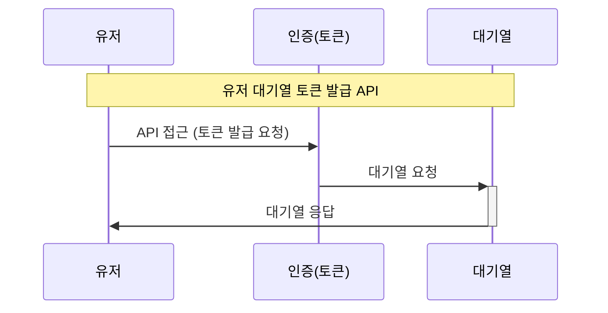
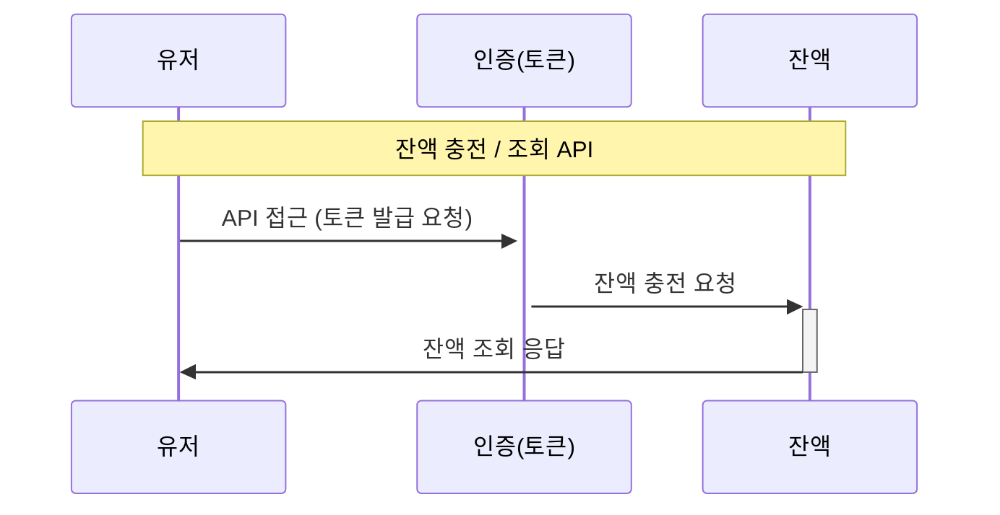
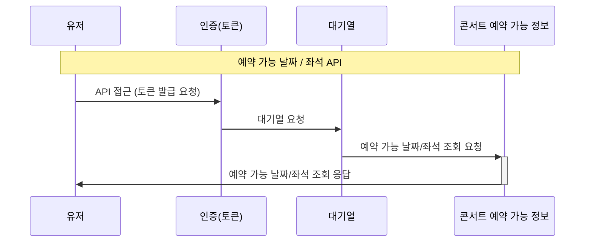
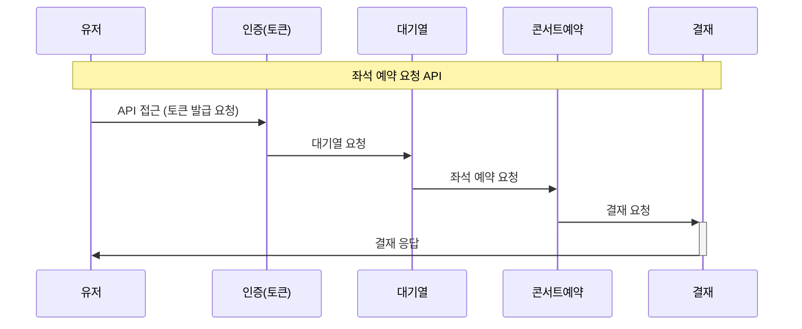

요구사항

## Description

- **`콘서트 예약 서비스`**를 구현해 봅니다.
- 대기열 시스템을 구축하고, 예약 서비스는 작업가능한 유저만 수행할 수 있도록 해야합니다.
- 사용자는 좌석예약 시에 미리 충전한 잔액을 이용합니다.
- 좌석 예약 요청시에, 결제가 이루어지지 않더라도 일정 시간동안 다른 유저가 해당 좌석에 접근할 수 없도록 합니다.

## Requirements

- 아래 5가지 API 를 구현합니다.
    - 유저 토큰 발급 API
    - 예약 가능 날짜 / 좌석 API
    - 좌석 예약 요청 API
    - 잔액 충전 / 조회 API
    - 결제 API
- 각 기능 및 제약사항에 대해 단위 테스트를 반드시 하나 이상 작성하도록 합니다.
- 다수의 인스턴스로 어플리케이션이 동작하더라도 기능에 문제가 없도록 작성하도록 합니다.
- 동시성 이슈를 고려하여 구현합니다.
- 대기열 개념을 고려해 구현합니다.

## API Specs

1. **`주요` 유저 대기열 토큰 기능**

- 서비스를 이용할 토큰을 발급받는 API를 작성합니다.
- 토큰은 유저의 UUID 와 해당 유저의 대기열을 관리할 수 있는 정보 ( 대기 순서 or 잔여 시간 등 ) 를 포함합니다.
- 이후 모든 API 는 위 토큰을 이용해 대기열 검증을 통과해야 이용 가능합니다.

> 기본적으로 폴링으로 본인의 대기열을 확인한다고 가정하며, 다른 방안 또한 고려해보고 구현해 볼 수 있습니다.
>

2. **`기본` 예약 가능 날짜 / 좌석 API**

- 예약가능한 날짜와 해당 날짜의 좌석을 조회하는 API 를 각각 작성합니다.
- 예약 가능한 날짜 목록을 조회할 수 있습니다.
- 날짜 정보를 입력받아 예약가능한 좌석정보를 조회할 수 있습니다.

> 좌석 정보는 1 ~ 50 까지의 좌석번호로 관리됩니다.
>

3.  **`주요` 좌석 예약 요청 API**

- 날짜와 좌석 정보를 입력받아 좌석을 예약 처리하는 API 를 작성합니다.
- 좌석 예약과 동시에 해당 좌석은 그 유저에게 약 5분간 임시 배정됩니다. ( 시간은 정책에 따라 자율적으로 정의합니다. )
- 만약 배정 시간 내에 결제가 완료되지 않는다면 좌석에 대한 임시 배정은 해제되어야 하며 다른 사용자는 예약할 수 없어야 한다.

4.  **`기본`**  **잔액 충전 / 조회 API**

- 결제에 사용될 금액을 API 를 통해 충전하는 API 를 작성합니다.
- 사용자 식별자 및 충전할 금액을 받아 잔액을 충전합니다.
- 사용자 식별자를 통해 해당 사용자의 잔액을 조회합니다.

5.  **`주요` 결제 API**

- 결제 처리하고 결제 내역을 생성하는 API 를 작성합니다.
- 결제가 완료되면 해당 좌석의 소유권을 유저에게 배정하고 대기열 토큰을 만료시킵니다.

!키포인트!
- 유저간 대기열을 요청 순서대로 정확하게 제공할 방법을 고민해 봅니다.
- 동시에 여러 사용자가 예약 요청을 했을 때, 좌석이 중복으로 배정 가능하지 않도록 합니다.

 
시퀀스 다이어그램

## <유저 대기열 토큰 발급 API>

## <잔액 충전/조회 API>

## <예약 가능 날짜/좌석 API>

## <좌석 예약 요청 API>

ERD 다이어그램

API 명세

- Endpoint - API 의 URL 및 기능을 설명할 수 있는 적절한 HTTP Method  
- Request - Param, Query, Body 등 API 호출 시 전달되어야 할 매개변수 및 데이터 
- Response - API 의 응답 코드, 데이터 등에 대한 명세 및 적절한 예제  
- Error - API 호출 중 발생할 수 있는 예외 케이스에 대해 명시  
- Authorization - 필요한 인증, 권한에 대해서도 명시  

### 1. 유저 대기열 토큰 ###
|               |                                                                                        |
|---------------|----------------------------------------------------------------------------------------|
| Endpoint      | POST /concert/{userId}/Token                                                           |
| Request       | Content-Type : 헤더 : application/json // 매개변수 : Integer userId, Integer concertOptionId |
| Response      | 상태코드 : 200 OK // 본문 {"token": "string"}                                                |
| Error         | 상태코드 : 400 Bad Reqeust                                                                 |
| Authorization |                                                                                        |

### 2. 예약 가능 날짜/좌석 API ###
|               |                                                                                                                            |
|---------------|----------------------------------------------------------------------------------------------------------------------------|
| Endpoint      | GET /concert/{concertId}/availability                                                                                      |
| Request       | Content-Type : 헤더 : application/json // 매개변수 : Integer concertId                                                           |
| Response      | 상태코드 : 200 OK // 본문 {"concertOptionId": "Integer ","availableSeats": [{"date": "2023-07-15","seats": ["01", "02", "03"]}]} |
| Error         | 상태코드 : 400 Bad Reqeust                                                                                                     |
| Authorization | token                                                                                                                      |

### 3. 좌석 예약 요청 API ###
|               |                                                                                             |
|---------------|---------------------------------------------------------------------------------------------|
| Endpoint      | POST /concert/{userId}/reservation                                                          |
| Request       | Content-Type : 헤더 : application/json // 매개변수 : Integer userId, Integer concertOptionId      |
| Response      | 상태코드 : 200 OK // 본문 {"reservationId": "Integer "."concertOptionId":"Integer " ,"seat":"01"} |
| Error         | 상태코드 : 404 Not Found                                                                        |
| Authorization | token                                                                                       |

### 4. 잔액 충전 / 조회 API ###
|               |                                                                                |
|---------------|--------------------------------------------------------------------------------|
| Endpoint      | GET /concert/{userId}/balance                                                  |
| Request       | Content-Type : 헤더 : application/json // 매개변수 : Integer userId, Integer balance |
| Response      | 상태코드 : 200 OK // 본문 {"token": "string","balance" : "Integer"}                  |
| Error         | 상태코드 : 404 Not Found                                                           |
| Authorization | x                                                                              |

### 5. 결재 API ###
|               |                                                                                               |
|---------------|-----------------------------------------------------------------------------------------------|
| Endpoint      | POST GET /concert/{userId}/payment                                                            |
| Request       | Content-Type : 헤더 : application/json // 매개변수 : Integer userId userId, Integer concertOptionId |
| Response      | 상태코드 : 200 OK // 본문 {"token": "string"}                                                       |
| Error         | 상태코드 : 400 404 Bad Not Reqeust Found                                                          |
| Authorization | token                                                                                         |

Mock API

1. 유저 대기열 토큰

|               |                                                                                |
|---------------|--------------------------------------------------------------------------------|
| Request       | Content-Type : 헤더 : application/json // 매개변수 : Integer userId, Integer concertOptionId |
| Response      | 상태코드 : 200 OK // 본문 {"token": "string"}                                                |

2. 예약 가능 날짜/좌석 API

|               |                                                                                |
|---------------|--------------------------------------------------------------------------------|
| Request       | Content-Type : 헤더 : application/json // 매개변수 : Integer concertId                                                           |
| Response      | 상태코드 : 200 OK // 본문 {"concertOptionId": "Integer ","availableSeats": [{"date": "2023-07-15","seats": ["01", "02", "03"]}]} |

3. 좌석 예약 요청 API

|               |                                                                                |
|---------------|--------------------------------------------------------------------------------|
| Request       | Content-Type : 헤더 : application/json // 매개변수 : Integer userId, Integer concertOptionId      |
| Response      | 상태코드 : 200 OK // 본문 {"reservationId": "Integer "."concertOptionId":"Integer " ,"seat":"01"} |

4. 잔액 충전 / 조회 API

|               |                                                                                |
   |---------------|--------------------------------------------------------------------------------|
   | Request       | Content-Type : 헤더 : application/json // 매개변수 : Integer userId, Integer balance |
   | Response      | 상태코드 : 200 OK // 본문 {"token": "string","balance" : "Integer"}                  |

5.결재 API

|               |                                                                                |
|---------------|--------------------------------------------------------------------------------|
| Request       | Content-Type : 헤더 : application/json // 매개변수 : Integer userId userId, Integer concertOptionId |
| Response      | 상태코드 : 200 OK // 본문 {"token": "string"}                                                       |

Swagger 이미지

동시성 문제와 극복

링크
https://velog.io/@rlaabcd/%ED%95%AD%ED%95%B4%ED%94%8C%EB%9F%AC%EC%8A%A4-%EB%8F%99%EC%8B%9C%EC%84%B1-%EB%AC%B8%EC%A0%9C%EC%99%80-%EA%B7%B9%EB%B3%B5-%EC%BD%98%EC%84%9C%ED%8A%B8-%EC%98%88%EC%95%BD-%EC%8B%9C%EC%8A%A4%ED%85%9C

