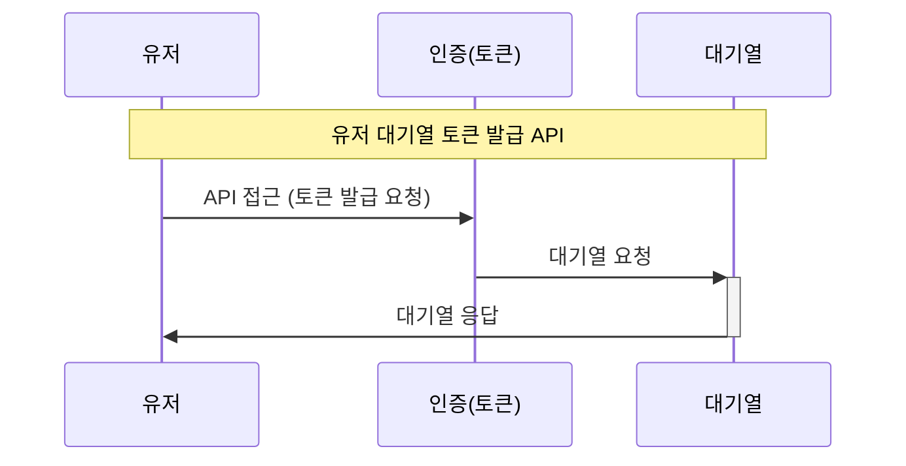
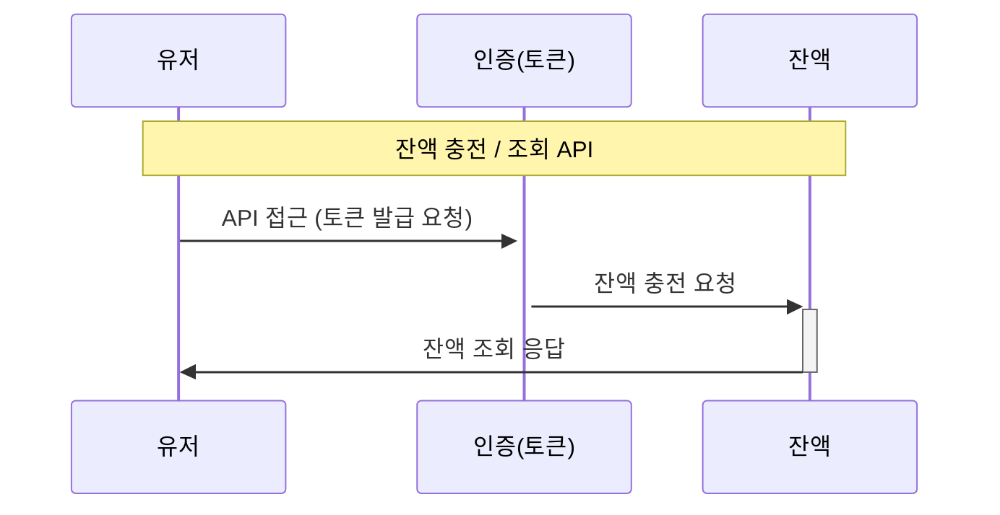
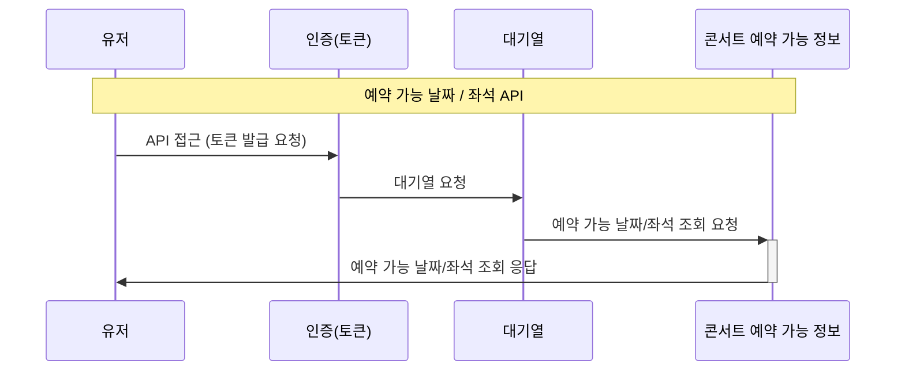
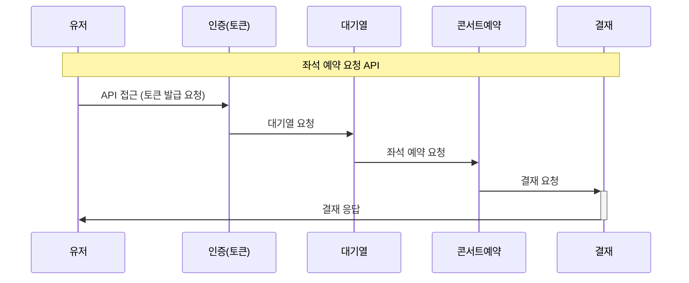

# 시퀀스 다이어그램

## <유저 대기열 토큰 발급 API>

```mermaid
sequenceDiagram
    participant 유저
    participant 인증(토큰)
    participant 대기열

    Note over  유저, 대기열 : 유저 대기열 토큰 발급 API
    유저 ->> 인증(토큰) :  API 접근 (토큰 발급 요청)
    인증(토큰) ->>+ 대기열: 대기열 요청
    대기열 ->>- 유저 : 대기열 응답

```

## <잔액 충전/조회 API>

```mermaid
sequenceDiagram
    participant 유저
    participant 인증(토큰)
    participant 잔액

    Note over 유저, 잔액 : 잔액 충전 / 조회 API
    유저 ->>+ 인증(토큰) : API 접근 (토큰 발급 요청)
    인증(토큰) ->>+ 잔액 : 잔액 충전 요청
    잔액 ->>- 유저 :  잔액 조회 응답
```

## <예약 가능 날짜/좌석 API>

```mermaid
sequenceDiagram
    participant 유저
    participant 인증(토큰)
    participant 대기열
    participant 콘서트 예약 가능 정보

    Note over 유저, 콘서트 예약 가능 정보 : 예약 가능 날짜 / 좌석 API
    유저 ->> 인증(토큰) :  API 접근 (토큰 발급 요청)
    인증(토큰) ->> 대기열: 대기열 요청
    대기열 ->>+ 콘서트 예약 가능 정보 : 예약 가능 날짜/좌석 조회 요청
    콘서트 예약 가능 정보 ->>- 유저 : 예약 가능 날짜/좌석 조회 응답
```

## <좌석 예약 요청 API>

```mermaid
sequenceDiagram
    participant 유저
    participant 인증(토큰)
    participant 대기열
    participant 콘서트예약
    participant 결재

    Note over 유저, 결재 : 좌석 예약 요청 API
    유저 ->> 인증(토큰) :  API 접근 (토큰 발급 요청)
    인증(토큰) ->> 대기열: 대기열 요청
    대기열 ->> 콘서트예약 : 좌석 예약 요청
    콘서트예약 ->>+ 결재 : 결재 요청
    결재 ->>- 유저 : 결재 응답

```

# ERD 다이어그램

