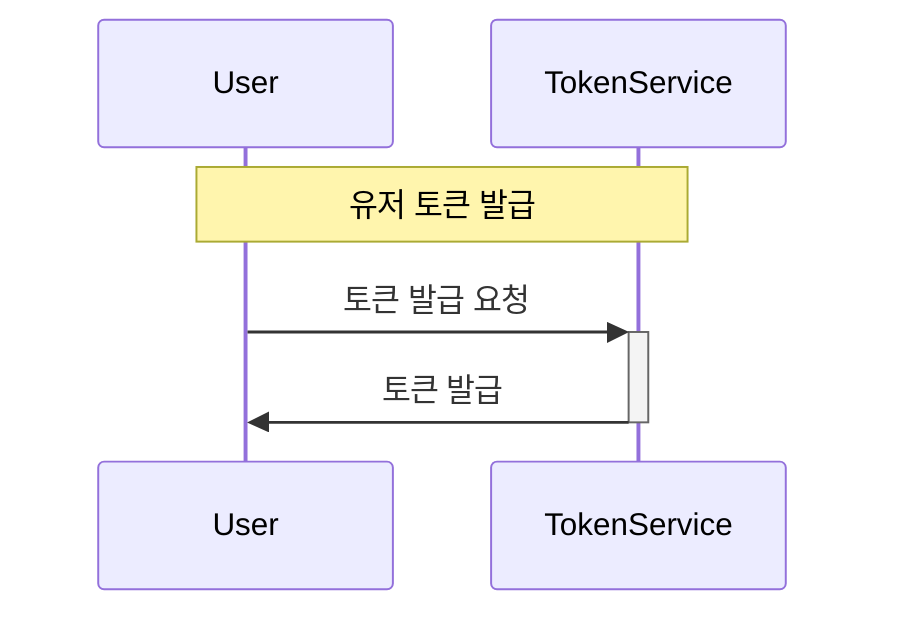
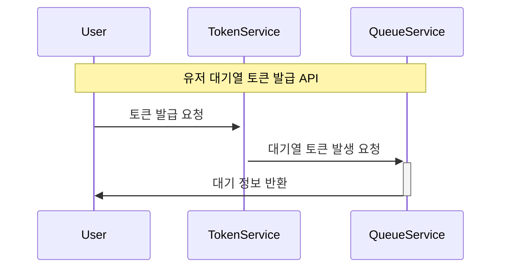
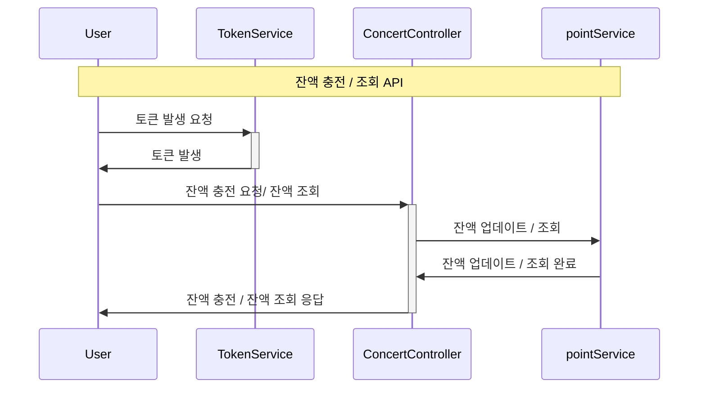
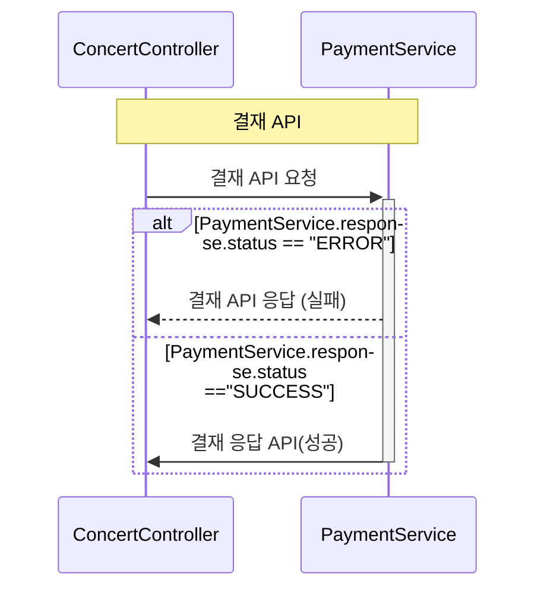
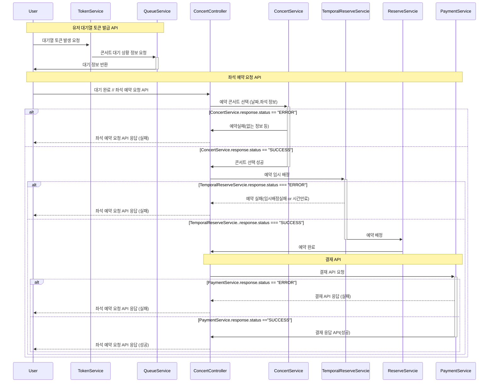

<유저 토큰 발급>

```mermaid
sequenceDiagram
    participant User
    participant TokenService

    Note over  User, TokenService : 유저 토큰 발급
    User ->>+ TokenService : 토큰 발급 요청
    TokenService->>-User: 토큰 발급


```

<유저 대기열 토큰 발급 API>

```mermaid
sequenceDiagram
    participant User
    participant TokenService
    participant QueueService
    
    Note over  User, QueueService : 유저 대기열 토큰 발급 API
    User ->>+ TokenService : 토큰 발급 요청
    TokenService->>+QueueService: 대기열 토큰 발생 요청
    QueueService->>-User: 대기 정보 반환

```

<잔액 충전/조회 API>

```mermaid
sequenceDiagram
    participant User
    participant TokenService
    participant ConcertController
    participant pointService


    Note over User, pointService : 잔액 충전 / 조회 API
    User ->>+ TokenService : 토큰 발생 요청
    TokenService ->>- User : 토큰 발생


    User ->>+ ConcertController : 잔액 충전 요청/ 잔액 조회
    ConcertController ->> pointService : 잔액 업데이트 / 조회
    pointService ->> ConcertController : 잔액 업데이트 / 조회 완료
    ConcertController ->>- User : 잔액 충전 / 잔액 조회 응답


```
<결재 API>

```mermaid
sequenceDiagram
    participant ConcertController
    participant PaymentService

                Note over ConcertController, PaymentService : 결재 API
              ConcertController ->>+ PaymentService : 결재 API 요청 
                    alt PaymentService.response.status == "ERROR"
                        PaymentService -->> ConcertController : 결재 API 응답 (실패)
                     else PaymentService.response.status =="SUCCESS"     
                        PaymentService ->>- ConcertController : 결재 응답 API(성공)
                    end    
```

<좌석 예약 요청 API>

```mermaid
sequenceDiagram
    participant User
    participant TokenService
    participant QueueService
    participant ConcertController
    participant ConcertService
    participant TemporalReserveServcie
    participant ReserveServcie
    participant PaymentService

    Note over  User, QueueService : 유저 대기열 토큰 발급 API
    User ->>+TokenService: 대기열 토큰 발생 요청
    TokenService->>+QueueService: 콘서트 대기 상황 정보 요청
    QueueService->>-User: 대기 정보 반환
    Note over User, PaymentService : 좌석 예약 요청 API
    User ->> ConcertController : 대기 완료 // 좌석 예약 요청 API
    ConcertController ->>+ ConcertService : 예약 콘서트 선택 (날짜,좌석 정보)
        alt ConcertService.response.status == "ERROR"
            ConcertService ->> ConcertController : 예약실패(없는 정보 등)
             ConcertController -->> User : 좌석 예약 요청 API 응답 (실패)
        else ConcertService.response.status == "SUCCESS"
            ConcertService ->>- ConcertController: 콘서트 선택 성공
            ConcertController ->>+ TemporalReserveServcie : 예약 임시 배정
                alt TemporalReserveServcie.response.status === "ERROR"
                TemporalReserveServcie -->>ConcertController: 예약 실패(임시배정실패 or 시간만료)
                ConcertController -->> User : 좌석 예약 요청 API 응답 (실패)
                else TemporalReserveServcie..response.status === "SUCCESS"
                TemporalReserveServcie ->>- ReserveServcie : 예약 배정
                ReserveServcie ->> ConcertController : 예약 완료
                Note over ConcertController, PaymentService : 결재 API
                ConcertController ->>+ PaymentService : 결재 API 요청 
                    alt PaymentService.response.status == "ERROR"
                        PaymentService -->> ConcertController : 결재 API 응답 (실패)
                        ConcertController -->> User : 좌석 예약 요청 API 응답 (실패)
                    else PaymentService.response.status =="SUCCESS"     
                        PaymentService ->>- ConcertController : 결재 응답 API(성공)
                 ConcertController -->> User : 좌석 예약 요청 API 응답 (성공)
                    end         
                end
        end
```